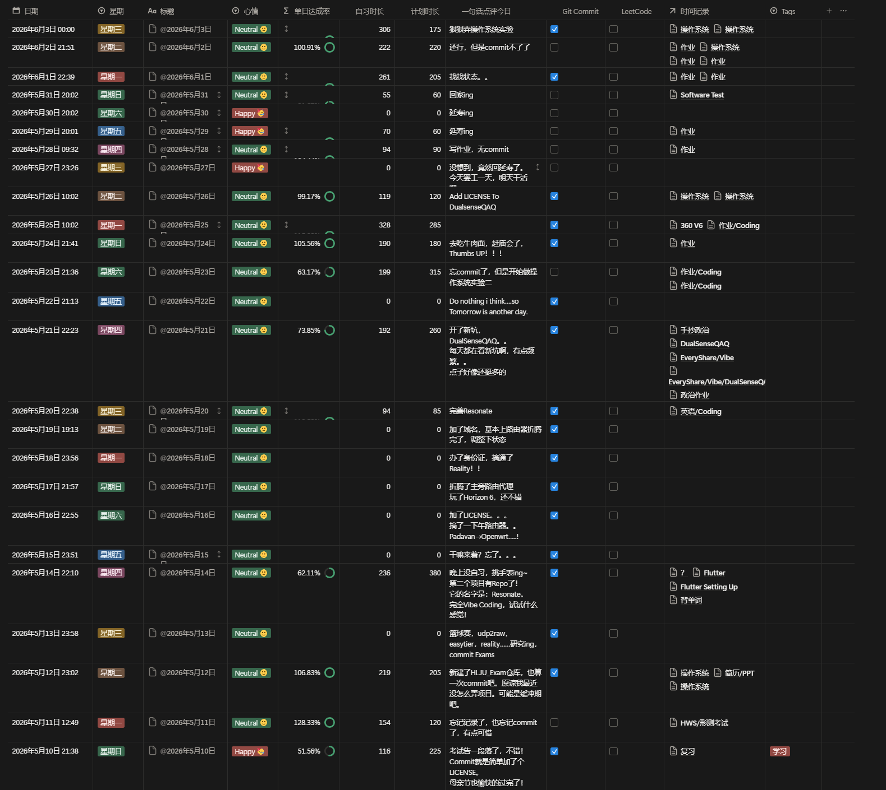

# EveryShare


> 注意: 本项目仍处于初期阶段, 请勿在工作环境下使用!

## 项目简介

EveryShare是一个基于局域网的, 跨平台的互传应用程序。

它的目标如名字一样

- **Share EveryWhere**
- **Share EveryThing**
- **Share EveryWay**

### 1. EveryWhere
无论何时何地, 只要有两部终端(~~至少能连在同一个局域网~~)就可以互相Share

最基本的要求, 已经有很多优秀的开源项目实现了这一点(如: [LocalSend](https://github.com/localsend/localsend))

### 2. EveryThing
不局限于传输文件

未来希望它能实现**近距离安卓音频共享**:

想和熟人一起收听手机里的音频？

或是随便找一个附近的陌生人一起听歌？聊天？

它**也许**能解决这个问题, 敬请期待!

### 3. EveryWay

市面上的这些互传软件选设备太无聊？

如果加上**NFC一碰连**的话, 会不会更有趣呢？(~~虽然好像已经有这样的技术了。不管, 我要做一个试试！~~)

> 以上提到的功能不一定都能实现, 也可能一个都实现不了(~~hahaha~~)
> 
> 没有了动力就会烂尾, 有了star就有动力！！！（疯狂明示......）

## 架构设计

### 项目结构

- core: Javalin(轻量Http服务器)实现网络底层传输逻辑, 封装发现与传输逻辑, 提供统一接口
- desktop: PC端平台
- android: 移动端平台
- web: 浏览器平台

### 通信协议

- UDP: 用于发现附近的设备
- HTTP: 通用通信协议
- TCP: 传输数据

## Getting Started

### QQQQQuickStart
1. 确保已安装JDK 17+
2. 前往[Release](https://github.com/BlackTeaOff/EveryShare/releases/tag/v0.1.0-alpha)里下载最新的`everyshare-0.1.0-alpha-jar-with-dependencies.jar`
3. 在终端/命令行运行`java -jar everyshare-0.1.0-alpha-jar-with-dependencies.jar`
4. 放心! 绝对不会有病毒的！(~~如果你觉得有, 那你太高估我了...~~)
5. 虽然没有病毒, 但是有BUG啊...(~~其实也算一种另类的病毒?！~~)

### SSSSSlowStart
1. 确保已安装JDK 17+和Maven
2. 克隆项目到本地

    ```git clone https://github.com/BlackTeaOff/EveryShare.git```

3. 使用IDE打开项目, 等待Maven下载依赖 
4. 运行`/src/main/java/com/blacktea/everyshare/demo/Terminal.java`
5. 开始体验EveryShare最最最最最DEMO的版本吧！(~~别抱太高期望哦~~)

### TODO

- [X] DiscoveryService
- [X] FileReceiver
- [X] FileSender
- [ ] 用Javalin重构Sender & Receiver
- [ ] 写一个更漂亮的Terminal！(带进度条的那种！)
- [ ] ...未完待续
- [ ] Desktop
- [ ] Android
- [ ] Web
- [ ] 断点续传
- [ ] NFC一碰传
- [ ] 文件夹传输
- [ ] Android音频共享

## Developer Log
为了让README不太无聊, 从这次commit开始

我决定在这里加一个Developer Log, 记录我开发过程中的一些碎碎念

以下是碎碎念示例:

### `2026/6/4`

再见面竟然是1个月以后了吗...

5月10日考完试之后, 感觉变懒了.

项目都没什么进度, 感觉自己浪费了很多时间.

我想找找我的时间浪费在了哪里.

看了一眼每日记录, 

这一个月里, 

我............

给妈妈过了母亲节!

折腾了路由器!

弄通了Reality!

玩了地平线6!

回老家玩了!

开了很多新坑! (虽然只是一个很大的坑而已)

.......................

好像还挺有意义的。

生活不止眼前枯燥的代码

还有诗~~和远······~~

不对, 好像有点偏题了。

我明明是来写 Developer Log 的!!!!

算了, 就写到这吧。



---

### `2026/5/9` 

项目刚刚做起来, 竟然要重构了？？！！

Sender和Receiver都要重写......

不过也还好吧, 毕竟还没走太远

还是学习学习LocalSend吧, 内置一个HTTP服务器要比Java的Socket好多了

几乎所有的平台都支持HTTP协议, 如果写Web端的话, 也会很方便

So......

~~Life is short, I use HTTP (笑~~

## Contribution
看到这里的人, 我要! 感谢! 你!!!

如果你对本项目感兴趣, 欢迎任何形式的贡献~

- 看完README并在心里给作者默默加油~
- 遇到BUG, 请提Issue(目前可能还真找不出什么bug)
- 有新点子, 也可以提Issue
- Fork/PR, ~~没用过~~ ~(不过可以试试)
- 或给个Star, 这是对我最最直接的支持!

> 写在最后:
> 
> 也许这是我第一次自己开始做一个规模比较大, 完整的项目吧。(~~有点紧张~~)
> 
> 不知道它的结局会是怎样......
> 
> 虽然但是, 无论如何, 继续加油吧~
> 
> 在看的人, 你也一样！
> 
> BlackTea - 2026/4/29
